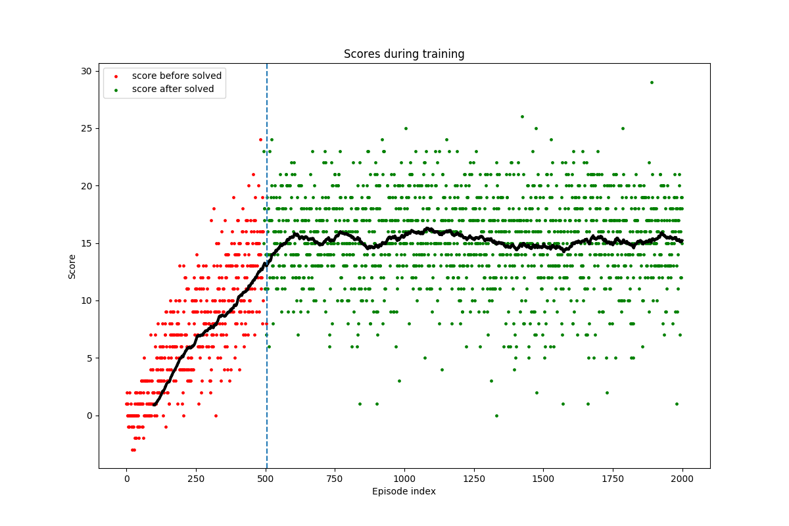

# Navigation Project

## Introduction

This is a report on the first project of the Deep Reinforcement Learning course from Udacity.  The basic goal is to
apply the algorithm as presented by the paper
[Human-level control through deep reinforcement learning, Google Deepmind](https://storage.googleapis.com/deepmind-media/dqn/DQNNaturePaper.pdf).
This was also implemented in an earlier exercise in solving the
[lunar lander problem](https://gym.openai.com/envs/LunarLander-v2/).  We base our implementation on the code for that
solution, while rewriting/reorganising most of it to get full understanding.

The basic construction is that we approximate the Q function using a neural network.  We implement two key strategies;
the first is experience replay, the second is delayed updating of the target function.  We'll describe where the code
for these two strategies is and how they are configured after a more global outline.

We take the Q function in slightly different form in stead of a function from states and actions to values we use the
function form

    Q : state space -> (list of action values))

So the neural network takes a state as input, and returns a list of values that is as long as there are actions.

## The environment

The agent is in a large square world and will need to collect bananas. Collecting a yellow banana gives a reward of +1,
a blue banana gives a reward of -1.

The agent is not given a camera in the space, all it has for sensing is a collection of rays (pointing generally
forward) that provide information on what can be sensed in the ray direction.  Length of the ray, and the details of
what they are sensing are not provided but we think of sensing up to a limited distance, and then the distance and
color and type (yellow banana, blue banana, zzz wall) of the object that the ray intersects.

From playing with the environment (interact.py) an episode in the environment is 300 steps of the environent.

## Environment summary

### Reward

| event         | reward  |
|---------------|:-------:|
| yellow banana |   +1    |
| blue banana   |   -1    |

### State space

37 dimensional; velocity + rays for sensing.

### Actions

| index   | action        |
|---------|---------------|
| 0       | move forward  |
| 1       | move backward |
| 2       | turn left     |
| 3       | turn right    |

### Solved

Mean score +13 over 100 consequtive episodes, where an episode consists of 300 steps in the environment.

## Network architecture

In the config file you see the network spec that was used to generate the network.

    network_spec:
      input_dim: 37
      hidden_1_size: 64
      activation_1: relu
      hidden_2_size: 64
      activation_2: relu
      output_dim: 4

It consists of two hidden layers, both followed by a rectified linear activation.  The input dimension is 37 which
corresponds to the input we get from the Unity environment, the output dimension coresponds to the number of actions.
This configuration is converted to a model in `model.py`.

## The agent

The agent class in `agent.py` it mediates the interaction between the environment and the model

## The training

We were told that using only the methods used from an earlier section, where we solved the lunar lander problem,
we should be able to solve the project in fewer than 1800 episodes.  We used the Adam optimizer with learning rate
0.0005.

## Results of training run

The following graph shows the results of the training run.  Every dot in the graph represents the score of an
episode (drawn above the index of the episode).  The dot is colored green if the average of the last 100 episodes
is above 13; red otherwise.  The vertical blue line indicates the point from where on the average never drops below
13 (left of it are a couple of green dots where the mean temporarily went above 13).  Finally the black line is the
moving average of the last 100 episodes (which starts a little later b/c it takes 100 episodes before you have a first
mean of 100 episodes).

The problem was really solved at after episode 505 (this is the point where the average of the last 100 episodes is
above 13 and then never drops below it).  Note that it confidently passes the score of 13, but relatively shortly
after essentially stops learning.

